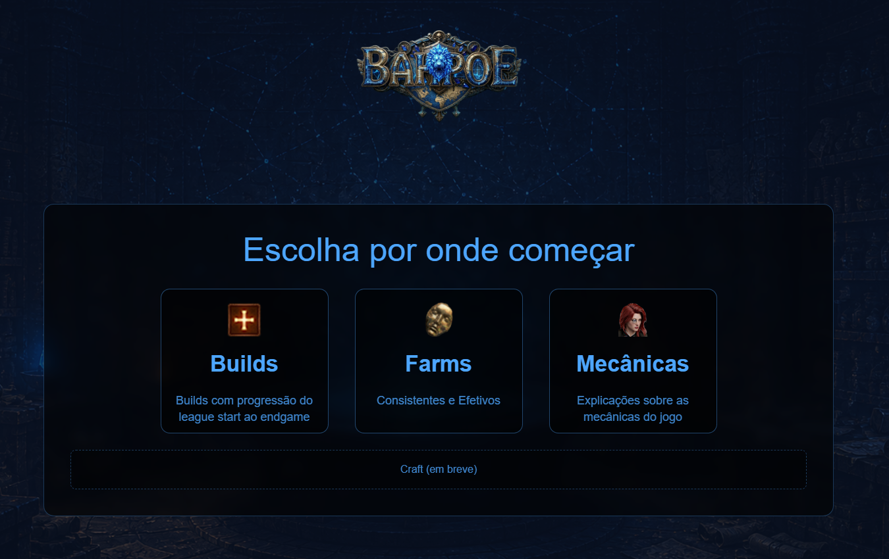
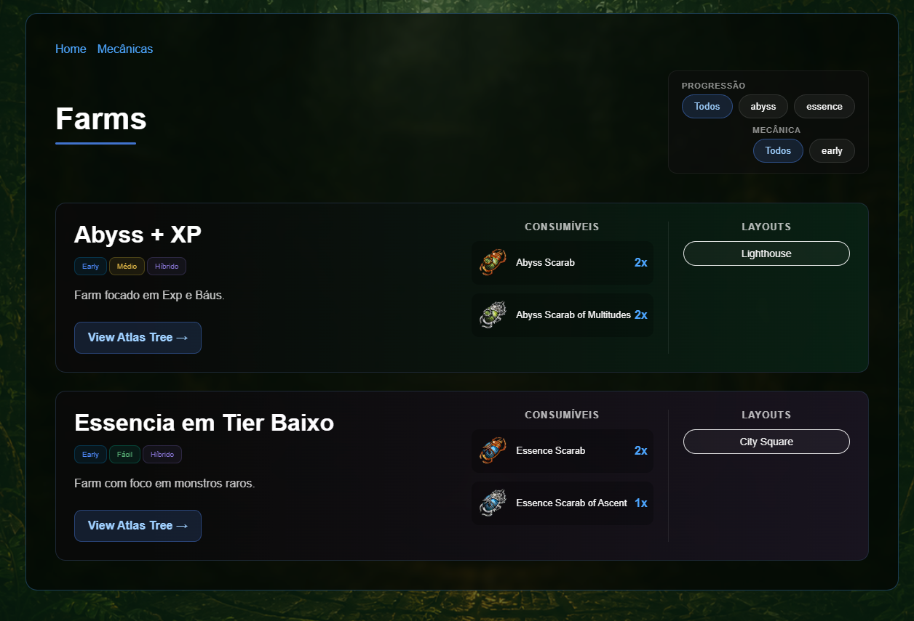
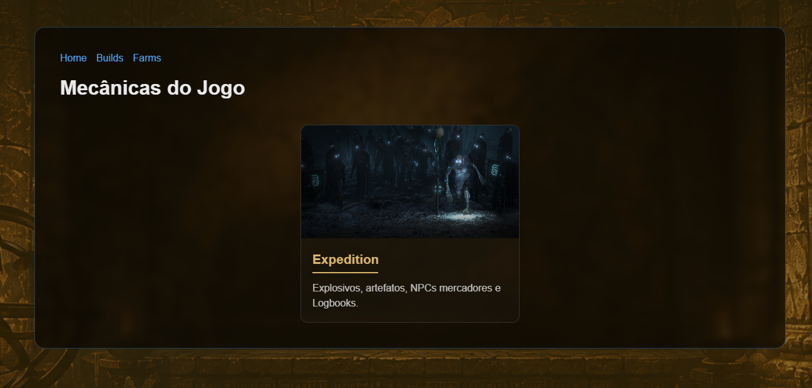

# BAH PoE

Plataforma educacional voltada para a comunidade brasileira de Path of Exile e Path of Exile 2.

## Objetivo

O projeto tem como objetivo centralizar conteúdos educacionais sobre os sistemas do jogo de forma organizada e acessível para jogadores iniciantes e intermediários.

Entre os conteúdos planejados estão:

* Mecânicas fundamentais do jogo
* Progressão de personagens
* Sistemas de crafting
* Conteúdo de endgame
* Builds e arquétipos
* Estratégias de farming
* Guias de ligas
* Ferramentas de consulta e comparação

## Tecnologias

* React
* Vite
* React Router
* GitHub Pages

## Status

Projeto em desenvolvimento contínuo.

## Aviso

Este produto não é afiliado nem endossado pela Grinding Gear Games.

# Screenshots

## Home

## Farms

## Mechanics

